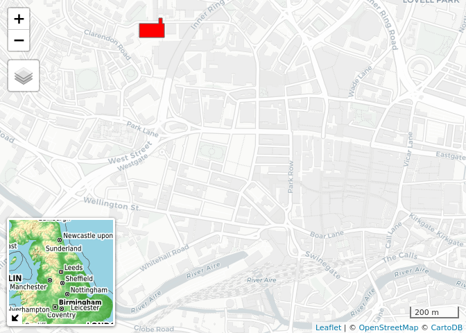

<!-- README.md is generated from README.Rmd. Please edit that file -->

## Geocomputation and Data Analysis with R

Geocomputation and Data Analysis with R is a 2 day course to be held on
the 25<sup>th</sup> and 26<sup>th</sup> April 2019 in the Leeds
Institute for Data Analytics (LIDA).

## Aim

The aim of the course is to get you up-to-speed with high performance
geographic processing, analysis and visualisation capabilities from the
command-line. The course will be delivered in R, a statistical
programming language popular in academia, industry and, increasing, the
public sector. It will teach a range of techniques using recently
developments in the package [**sf**](https://github.com/r-spatial/sf)
and the ‘metapackage’ [**tidyverse**](https://www.tidyverse.org/), based
on the open source book [Geocomputation with
R](https://geocompr.robinlovelace.net/) (Lovelace, Nowosad, and Meunchow
2019).

## Learning objectives

By then end of the course participants should:

  - Be able to use R and RStudio as a powerful Geographic Information
    System (GIS)
    <!-- What the different panels within RStudio are and how to use the view panel interactively -->
  - Know how R’s spatial capabilities fit within the landscape of open
    source GIS software <!-- What are the alternatives to R? -->
    <!-- What are it's strengths/weaknesses? -->
    <!-- How can R interface to dedicated GIS software like QGIS? -->
  - Be confident with using R’s command-line interface (CLI) and
    scripting capabilities for geographic data processing
    <!-- autocompletion --> <!-- using help -->
    <!-- knowing where to search and create a reproducible example to ask questions on a community forum -->
    <!-- source vs console editor --> <!-- projects and scripts -->
    <!-- functions / algorithms -->
  - Understand how to import a range of data sources into R
    <!-- read-in a shapefile --> <!-- write-out a geojson -->
    <!-- 7.2 Retrieving open data -->
    <!-- 7.3 Geographic data packages -->
    <!-- 7.4 Geographic web services --> <!-- 7.5 File formats -->
    <!-- 7.6 Data Input (I) --> <!-- 7.7 Data output (O) -->
  - Be able to perform a range of attribute operations such as
    subsetting and joining <!-- 3.2.1 Vector attribute subsetting -->
    <!-- 3.2.2 Vector attribute aggregation -->
    <!-- 3.2.3 Vector attribute joining -->
    <!-- 3.2.4 Creating attributes and removing spatial information -->
  - Understand how to implement a range of spatial data operations
    including spatial subsetting and spatial aggregation
    <!-- 4.2.1 Spatial subsetting -->
    <!-- 4.2.2 Topological relations --> <!-- 4.2.3 Spatial joining -->
    <!-- 4.2.4 Non-overlapping joins -->
    <!-- 4.2.5 Spatial data aggregation -->
  - Have the confidence to output the results of geographic research in
    the form of static and interactive maps
    <!--     8.2.1 tmap basics --> <!--     8.2.2 Map objects -->
    <!--     8.2.3 Aesthetics --> <!--     8.2.4 Color settings -->
    <!--     8.2.5 Layouts --> <!--     8.2.6 Faceted maps -->
    <!-- 8.4 Interactive maps -->

## Location

Leeds Institute for Data Analytics, 40 University Road, LS2 9JT. It can
be seen on [OpenStreetMap](https://www.openstreetmap.org/way/84749920),
on the [LIDA website](https://lida.leeds.ac.uk/about-lida/contact/) and
highlighted in red below (it’s a 20 minute walk from the station):

<!-- -->

## Course contents

### Day 1: Foundations

09:00-09:30 Arrival and set-up

09:30-11:00 Introduction to the course and software

  - Introduction to R
  - R installation questions/debugging
  - How to use RStudio (practical in groups of 2)
  - R classes and working with data frames (CC)

11:15-12:30: TBC

<!-- And example from the PCT -->

**Lunch**

13:30-15:00 Spatial data in R

  - Spatial data in R
  - R’s spatial ecosystem (see section [1.4 of Geocomputation with R -
    package
    ecosystem](https://geocompr.robinlovelace.net/intro.html#rs-spatial-ecosystem))
  - Practical: [Section 3.2
    to 3.2.2](https://geocompr.robinlovelace.net/attr.html#vector-attribute-manipulation)
    of
    handouts
  - [Exercises](https://geocompr.robinlovelace.net/attr.html#exercises-1):
    1 to 3 in the hand-outs
  - Further reading:
    [Chapter 7](https://geocompr.robinlovelace.net/read-write.html) of
    Geocomputation with R - data import/export and
    [exercises](https://geocompr.robinlovelace.net/read-write.html)
  - Bonus (relies on internet/data): read-in and analyse datasets you
    use at work as data frames or sf objects.

15:15-16:30 TBC

### Day 2 GIS, visualisation, modelling

09:30-11:00 TBC

11:15-12:30: TBC

<!-- And example from the PCT -->

**Lunch**

13:30-15:00 TBC

15:15-16:30 TBC

## Prerequisites

### Prior reading/experience

If you are new to R, ensure you have attempted a basic introductory
course such as DataCamp’s [introduction to
R](https://www.datacamp.com/courses/free-introduction-to-r) free course
or equivalent.

If you’re interested in R for ‘data science’ and
installing/updating/choosing R packages, these additional resources are
recommended (these optional resources are all freely availble online):

  - The introductory chapter of [R for Data
    Science](https://r4ds.had.co.nz/introduction.html)
  - Chapter 2 on [setting-up
    R](https://csgillespie.github.io/efficientR/set-up.html) and section
    4.4 on [package
    selection](https://csgillespie.github.io/efficientR/workflow.html#package-selection)
    in the book *Efficient R Programming* \#\#\# Computing requirements

Attendees are expected to bring their own laptop with the following
packages installed and working. You can check these are all installed,
and install those that are not installed, as follows (you can also just
type `install.packages("sf")` etc):

``` r
install.packages("osmdata")   # for working with open street map data
install.packages("sf")        # a package for working with spatial data
install.packages("spData")    # provides example data
install.packages("stplanr")   # a transport data package
install.packages("tidyverse") # metapackage for data science
install.packages("tmap")      # a mapping package

# Make sure your packages are up-to-date with:
update.packages()
```

## Reproducible example

The code in the following example checks you have the necessary packages
installed. It results in a map that will guide you to the location of
the course.

Attach the packages:

``` r
library(sf)
library(stplanr)
library(tidyverse)
```

The overall route assuming you’re travelling from London:

``` r
uk = spData::world %>% 
  filter(name_long == "United Kingdom")
origin_lnd = c(-0.1, 51.5)
destination = c(-1.55, 53.8)
odmatrix = matrix(c(origin_lnd, destination), ncol = 2, byrow = TRUE)
line_lnd = st_linestring(odmatrix) %>% 
  st_sfc() %>% 
  st_sf(crs = 4326)
plot(st_geometry(uk), col = "grey")
plot(line_lnd, add = TRUE, lwd = 5, col = "red")
```

<!-- -->

## References

<div id="refs" class="references">

<div id="ref-lovelace_geocomputation_2019">

Lovelace, Robin, Jakub Nowosad, and Jannes Meunchow. 2019.
*Geocomputation with R*. CRC Press.

</div>

</div>
